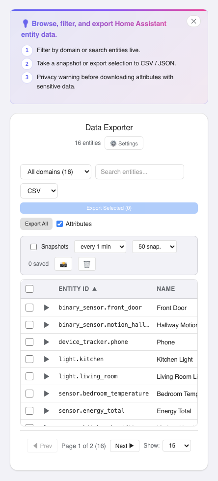

# HA Data Exporter\n\nExport Home Assistant data to CSV, JSON, and other formats. Supports entity history, statistics, automation logs, and custom date range selections.\n\n## Installation\n\n### HACS (recommended)\n\n1. Open HACS in Home Assistant\n2. Go to **Frontend** section\n3. Click **⋮** (three dots) > **Custom repositories**\n4. Add `https://github.com/MacSiem/ha-data-exporter` as **Dashboard** (or **Plugin**)\n5. Install **HA Data Exporter**\n6. Restart Home Assistant\n\n### Manual\n\nCopy the contents to `/config/www/community/ha-data-exporter/`\n\n## Design\n\nUses **Modern Bento Light Mode** design system:\n- Background: `#F8FAFC`\n- Primary: `#3B82F6`\n- Text: `#1E293B`\n- Border: `#E2E8F0`\n- Font: Inter, 16px border-radius, smooth animations\n\n## License\n\nMIT\n

