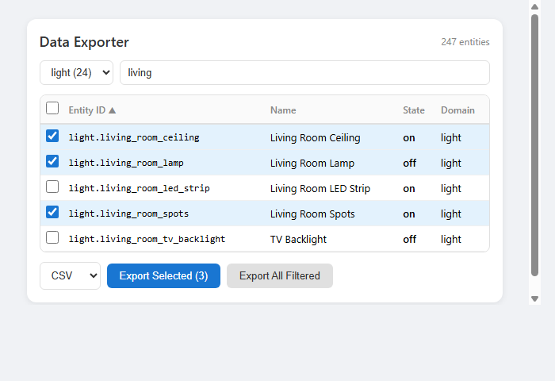
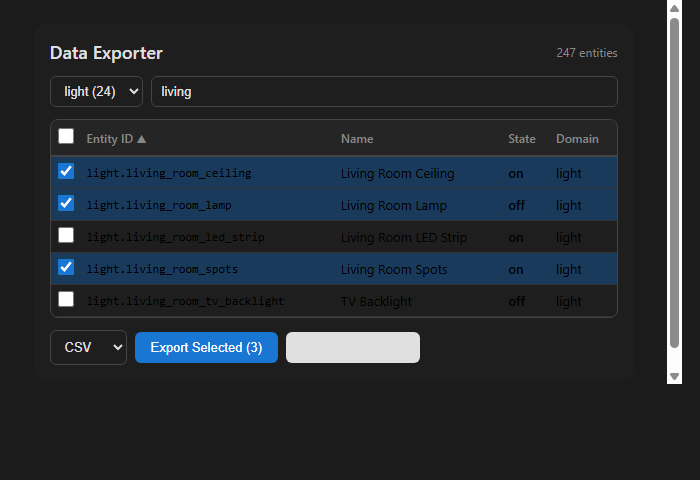

# Home Assistant Data Exporter

[](https://github.com/MacSiem/ha-data-exporter/actions/workflows/validate.yml)
[](https://github.com/hacs/integration)

A Lovelace card for Home Assistant that lets you browse, search, filter, and export your entities data to **CSV**, **JSON**, or **YAML**.



## Features

- Browse all entities with search and domain filtering
- Sort by entity ID, name, state, or domain
- Select individual entities or bulk-select all
- Export to CSV, JSON, or YAML format
- Includes entity attributes in export
- Pagination for large entity lists
- Light and dark theme support

## Installation

### HACS (Recommended)

1. Open HACS in your Home Assistant
2. Go to Frontend → Explore & Download Repositories
3. Search for "Data Exporter"
4. Click Download

### Manual

1. Download `ha-data-exporter.js` from the [latest release](https://github.com/MacSiem/ha-data-exporter/releases/latest)
2. Copy it to `/config/www/ha-data-exporter.js`
3. Add the resource in Settings → Dashboards → Resources:
   - URL: `/local/ha-data-exporter.js`
   - Type: JavaScript Module

## Usage

Add the card to your dashboard:

```yaml
type: custom:ha-data-exporter
title: Data Exporter
default_format: csv
show_attributes: true
page_size: 50
```

### Configuration

| Option | Type | Default | Description |
|--------|------|---------|-------------|
| `title` | string | `Data Exporter` | Card title |
| `default_format` | string | `csv` | Default export format: `csv`, `json`, or `yaml` |
| `show_attributes` | boolean | `true` | Include entity attributes in export |
| `page_size` | number | `50` | Number of entities per page |
| `domains` | list | `null` | Restrict to specific domains (e.g., `['sensor', 'light']`) |

### Export Formats

**CSV** - Spreadsheet-compatible with flattened attributes as columns. Opens directly in Excel, Google Sheets, etc.

**JSON** - Structured format with nested attributes. Ideal for programmatic processing and API integration.

**YAML** - Home Assistant-native format. Perfect for sharing entity configurations and documentation.

## Examples

### Export only sensors and lights

```yaml
type: custom:ha-data-exporter
title: Sensor & Light Export
domains:
  - sensor
  - light
default_format: json
```

### Compact view

```yaml
type: custom:ha-data-exporter
title: Quick Export
show_attributes: false
page_size: 25
```

## Screenshots

| Light Theme | Dark Theme |
|:-----------:|:----------:|
|  |  |

## License

MIT License - see [LICENSE](LICENSE) file.
