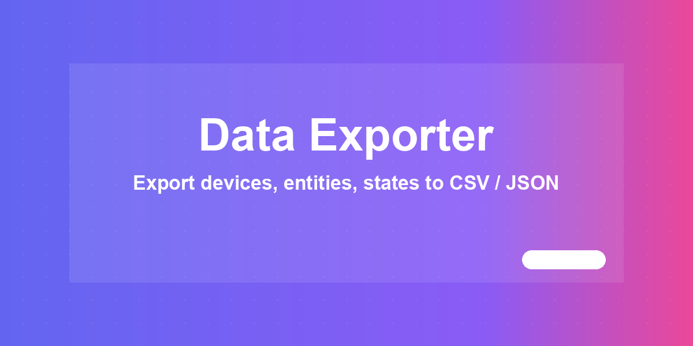
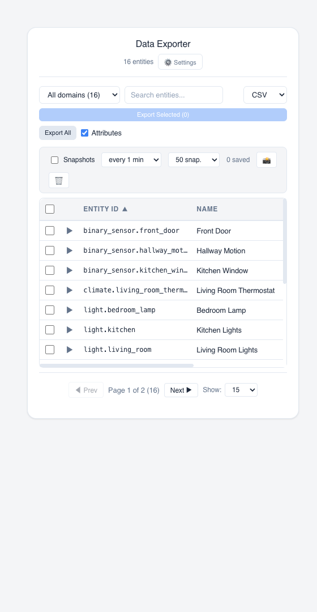
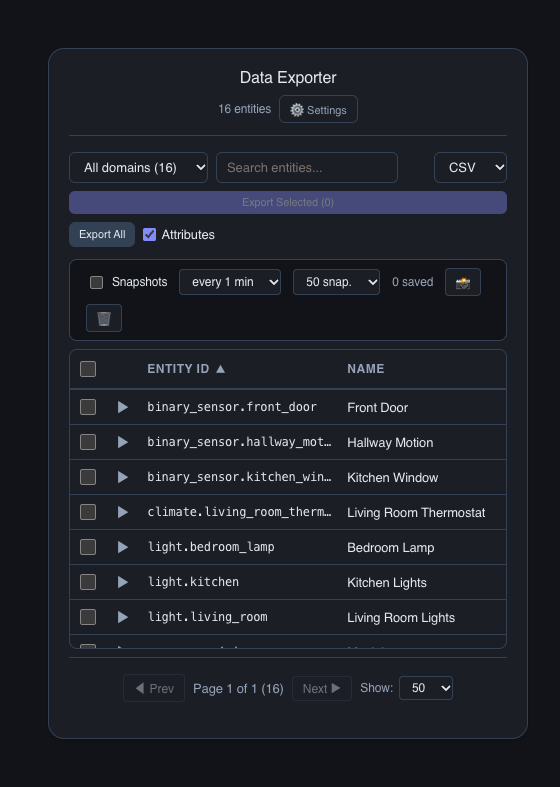

# 📤 Data Exporter



Browse, filter and export Home Assistant entity data — states and attributes
to CSV / JSON / YAML, with optional local snapshots for a lightweight trend
history. Zero configuration: add the card and it lists every entity in your
instance.

[](https://github.com/MacSiem/ha-data-exporter/releases) [](LICENSE)

> Part of the [HA Tools](https://github.com/MacSiem) ecosystem — split into individual HACS-installable plugins.

## How it works

**Short version: it works automatically.** The card needs no configuration and
no extra integration:

1. **Entities from HA state.** On load, the card lists every entity from
   `hass.states` — domain filter, live text search, and sortable columns
   (Entity ID / Name / State / Domain / Attribute count).
2. **Attribute drill-down + 24h history.** Expanding a row shows its full
   attribute set and, on demand, its last 24h of state changes fetched from
   your own Home Assistant instance (`/api/history/period`).
3. **Export on your terms.** Select rows (or export everything currently
   filtered) as CSV, JSON or YAML, with attributes optionally included. The
   export also joins Home Assistant's entity, device and area registries to
   include device and area IDs and names. An entity's own area assignment takes
   precedence over its device's area. A privacy confirmation is shown before
   every download.
4. **Optional local snapshots.** Turn on periodic snapshots (interval from
   30s to 1h) to build a lightweight, browser-local trend history per entity
   — independent of HA's recorder/history retention.

### What is automatic vs. manual

| Automatic | Manual (optional) |
|---|---|
| Listing every entity, with domain counts | Filtering by domain / search text |
| Sortable table columns | Selecting rows to export vs. "Export All" |
| Live entity count + pagination (15/25/50/100 per page) | Choosing export format: CSV / JSON / YAML |
| Theme follows your Home Assistant theme (light/dark) | Including attributes in the export |
| Confirming before an export leaves your device | Enabling periodic local snapshots + interval/retention |

## Screenshots

| Light | Dark |
|---|---|
|  |  |

*The entity browser with synthetic entity names: domain filter, search,
sortable table, export controls and snapshot bar. Dark mode follows your Home
Assistant theme.*

## Installation

**Data Exporter is in the HACS default store** (category: **Plugin** / Lovelace dashboard resource) — no custom repository needed:

1. Open **HACS** in Home Assistant
2. Search for **Data Exporter**
3. Install and refresh your browser

[](https://my.home-assistant.io/redirect/hacs_repository/?owner=MacSiem&repository=ha-data-exporter&category=plugin)

## Quick start

```yaml
type: custom:ha-data-exporter
```

That's it — no options are required. Optional config:

```yaml
type: custom:ha-data-exporter
title: Data Exporter
default_format: csv        # csv | json | yaml
domains:                    # restrict the browser to specific domains
  - sensor
  - light
  - switch
storage_key: living_room    # separate snapshot storage per card instance
```

### Optional sidebar panel (`configuration.yaml`)

```yaml
panel_custom:
  - name: ha-data-exporter
    sidebar_title: Data Exporter
    sidebar_icon: mdi:home-assistant
    url_path: ha-data-exporter
    js_url: /local/community/ha-data-exporter/ha-data-exporter.js
    embed_iframe: false
    config: {}
```

After restart, **Data Exporter** appears in the HA sidebar.

> The card's visual editor currently only exposes the **Title** field. Set
> `default_format`, `domains`, `show_attributes`, `show_select_all`,
> `page_size` or `storage_key` via YAML as shown above.

## Features

- Browse every entity in your instance with a live domain filter and text search.
- Sortable table — Entity ID, Name, State, Domain, Attribute count.
- Expandable per-entity attribute view, plus on-demand 24h state history from
  Home Assistant's own history API.
- Export selected entities, or everything currently filtered, to **CSV, JSON
  or YAML** — with device and area columns and attributes optionally included.
- CSV protects spreadsheet cells containing formula-like text; numeric values
  stay numeric.
- Privacy confirmation dialog before every export.
- Optional periodic snapshots (30s–1h interval, 20–200 kept) for a
  browser-local trend history per entity, independent of HA's recorder.
- Bundled Bento Design System (light + dark mode, follows your HA theme, mobile-friendly).
- Self-contained — no shared HA Tools dependency.
- Tool settings, snapshots and dismissed-banner state are cached in browser `localStorage`.

## FAQ

**Do I have to configure anything?**
No. Add the card and it lists every entity in your Home Assistant instance by itself.

**Does this send my data anywhere?**
No third-party or cloud calls. On export, the card reads the entity, device and
area registries through your **own** Home Assistant WebSocket API. Expanding an
entity row loads its 24h history from your Home Assistant REST API
(`/api/history/period`). Exports are generated and downloaded entirely in your
browser; nothing is uploaded. Because exported files can contain entity names,
locations and sensor values, the card shows a confirmation dialog before every
download and warns you not to share exports publicly or with third-party
services without informed consent.

**Where are snapshots stored?**
In your browser's `localStorage`, per browser and per device. Clearing browser
data removes them. Use CSV/JSON/YAML export for a permanent copy.

**Can I keep separate snapshot histories per card instance?**
Yes — set `storage_key: <name>` in the card YAML. Snapshots *and* snapshot
settings (interval, retention, enabled state) are stored in `localStorage`
under that name, so each card with its own `storage_key` gets an independent
snapshot namespace. Cards without a `storage_key` all share the `default`
namespace.

**Which export formats are supported?**
CSV, JSON and YAML, selectable per export. You can toggle whether attributes
are included, independent of the format.

**Can I limit the browser to specific domains?**
Yes — set `domains: [sensor, light, ...]` in the card YAML (see Quick start).

## Changelog

See [CHANGELOG.md](CHANGELOG.md).

## Support

If this tool makes your Home Assistant life easier, consider supporting the project:

- [☕ Buy Me a Coffee](https://buymeacoffee.com/macsiem)
- [💳 PayPal](https://www.paypal.com/donate/?hosted_button_id=Y967H4PLRBN8W)

The optional in-card support link is shown only to administrators. Dismiss it in the card or set `show_support: false` in the card configuration.

## License

MIT — see [LICENSE](LICENSE).

## Privacy and data

Exports are downloaded by your browser and may contain entity names, device/area labels, states and attributes. Review the privacy confirmation and selected fields before downloading. Keep exports private; use synthetic records when reporting a bug.

See [SECURITY.md](SECURITY.md) for safe vulnerability reporting and [NOTICE](NOTICE) for licensing notices.

First-run guidance and optional support labels follow the Home Assistant language (Polish or English, including Polish regional locales). Ordinary language updates preserve the focused search and text selection, selected entities, format, attribute choice and dismissed guidance/support.
